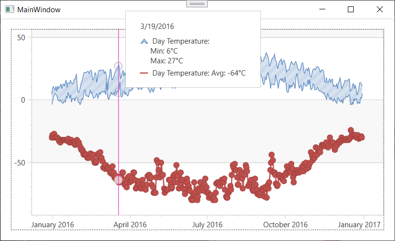

<!-- default badges list -->

<!-- default badges end -->

# Chart for WPF - Use the MVVM Binding Style to Generate Series of Different View Types 

This example generates different Series from a view model. Clicking on a series changes its type from Line to Range Area.

## Implementation Details

The `XYDiagram2D.SeriesItemsSource` property defines a collection of objects used to generate Series. To bind series view models to a chart, use the `SeriesItemsSource` property of a diagram. To configure how the series view model converts to a series on a chart, use `SeriesItemTemplate` or `SeriesItemTemplateSelector`. In this example, the Template Selector converts the selected series type from Line to Range Area.

Note that you can bind secondary axes and custom labels using the same approach. 

## Files to Review

<!-- default file list -->

* **[MainWindow.xaml](./CS/MvvmChart/MainWindow.xaml) (VB: [MainWindow.xaml](./VB/MvvmChart/MainWindow.xaml))**
* [MainWindow.xaml.cs](./CS/MvvmChart/MainWindow.xaml.cs) (VB: [MainWindow.xaml.vb](./VB/MvvmChart/MainWindow.xaml.vb))
* [ViewModel.cs](./CS/MvvmChart/ViewModel.cs) (VB: [ViewModel.vb](./VB/MvvmChart/ViewModel.vb))
<!-- default file list end -->
## More Examples

[Chart for WPF - Use the MVVM Binding Style to Generate Series of an Identical View Type](https://github.com/DevExpress-Examples/wpf-charts-create-multiple-series-of-identical-view-mvvm)
<!-- feedback -->
## Does this example address your development requirements/objectives?

 

(you will be redirected to DevExpress.com to submit your response)
<!-- feedback end -->
